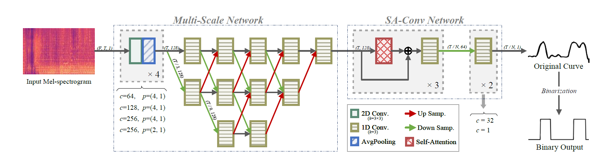
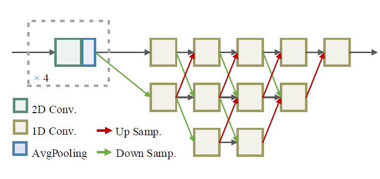
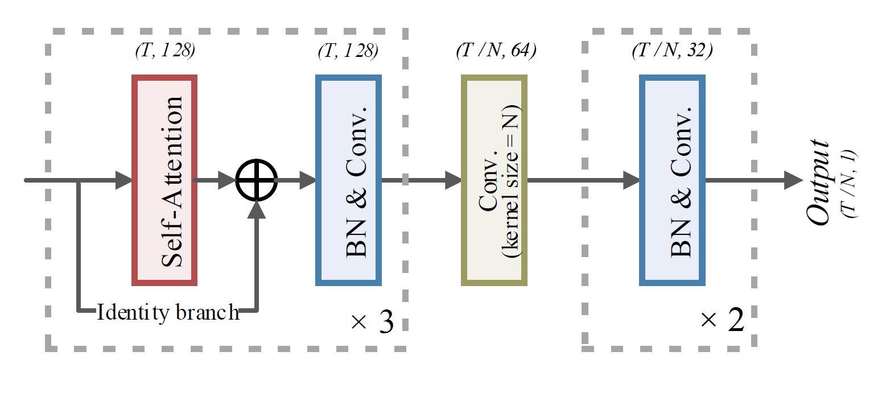
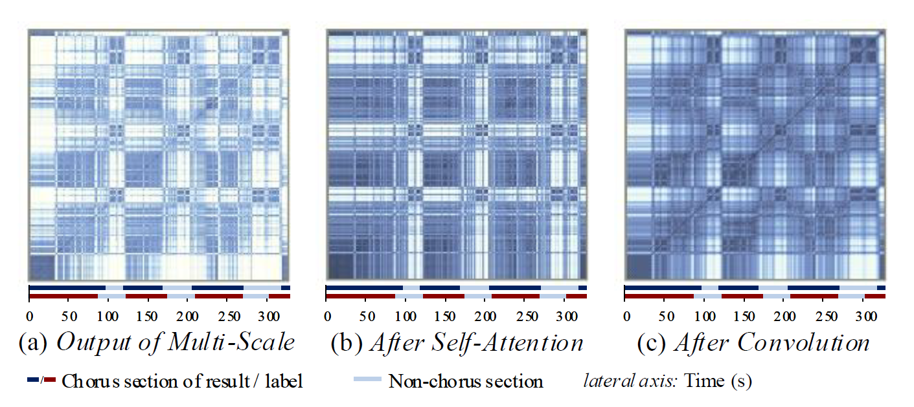
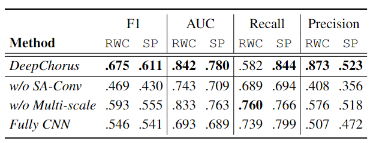
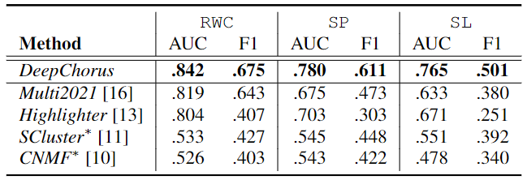
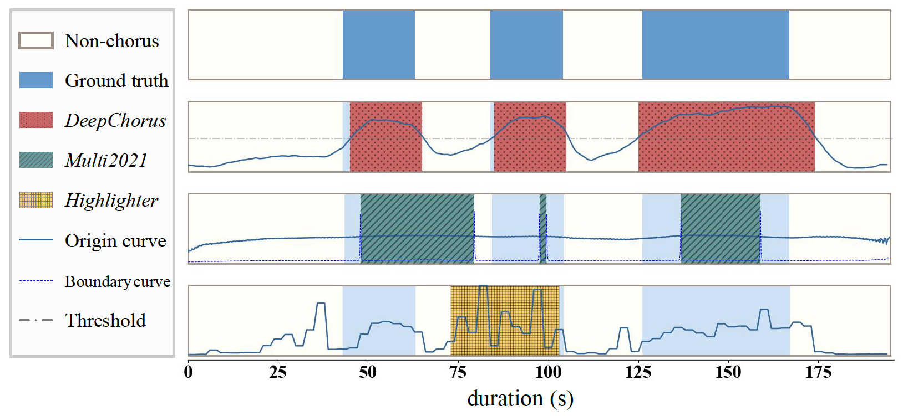

DeepChorus Version 1.0
===========================
中文 | [English]()
## 目录
* [概览](#任务概览)
* [模型](#模型介绍)
    * [多分辨率网络](#多分辨率网络)（High Resolution Network, HRNet)
    * [自注意力卷积](#自注意力卷积)（Self-Attention）
* [实验结果](#实验结果)
    * [消融实验](#消融实验)
    * [对比实验](#对比实验)
* [快速使用](#快速使用)
* [引用](#引用)


## 任务概览


副歌提取（Chorus Detection）旨在提取出一段乐曲中的副歌（乐曲中重复最多或“最抓耳”的部分）段落。本任务开创性地提出了一种结合多分辨率和自注意力机制的端到端副歌检测模型DeepChorus。

本模型的实验结果在大多数情况下都优于现有的最先进的方法。


## 模型介绍
本模型的实验结果在大多数情况下都优于现有的最先进的方法。


DeepChorus的总体框架如图所示。
我们将合唱检测视为一个分类问题，模型的输出是一个二进制向量，表示副歌或非副歌。 模型以mel频谱图作为输入，同时输入歌曲可以是任意长度。

### 多分辨率网络
<div align="center"></div>

该模块结构和加入模块前后的效果如上所示。

该策略的核心思想是:先将输入特征下采样到低分辨率以方便提取全局信息，然后再合并到高分辨率。 通过对不同尺度下采样/上采样，并重复交换信息，可以得到能够区分副歌和非副歌的向量，并在几层之后突出区域信息进行进一步处理。

### 自注意力卷积
<div align="center"></div>

我们设计了一个SA-Conv（Self-Attention Convolution）模块作为基本模块。 在块中，使用了自注意层和卷积层。 三个SA-Conv块依次堆叠形成主体结构。本模块采用两个卷积层将序列处理成概率曲线，表示副歌的存在与否。  

网络中，自注意力卷积的过程可视化:

<div align="center"></div>

## 实验结果

### 消融实验
加入HRNet与否，或加入SA-Conv模块与否的消融实验结果：

<div align="center"></div>

### 对比实验
和[Pop-Music-Highlighter]("github.com/remyhuang/pop-music-highlighter")、[2021ICASSP]("ieeexplore.ieee.org/abstract/document/9413773")、
[SCluster]("ieeexplore.ieee.org/abstract/document/6637644")、[CNMF]("archives.ismir.net/ismir2014/paper/000319.pdf")的对比结果：

<div align="center"></div>
   
和几个baseline对比的可视化：
<div align="center"></div>

## 快速使用

### 环境需求
```python
python==3.6.2
tensorflow==2.1.0
librosa==0.8.1
joblib==1.1.0
madmom==0.16.1  #(运行ICASSP 2021 baseline 时需要）
```

### 提取特征
请先在extract_spectrogram.py中将 'source_path' 更换为音源路径。

执行：
```python
python ./preprocess/extract_spectrogram.py
```
### 预训练模型测试
请将constant.py中的 "test_feature_files" 和 "test_annotation_files" 参数分别替换为 __提取好的特征joblib文件__ 和 __指定标签格式的joblib__ 文件，其中标签的格式为：
```python
dict = { 'song_name' = [[0, 10], [52, 80], ...], ...}
```

执行：
```python
python ./test.py -n DeepChorus -m Deepchorus_2021
```
该程序返回测试集的R, P, F及AUC结果。

### 训练
训练需要将constant.py中的 "train_feature_files" 和 "train_annotation_files" 参数分别替换为 __提取好的特征joblib文件__ 和 __指定标签格式的joblib__ 文件，其中标签的格式同上。
执行：
```python
python ./train.py -n DeepChorus -m Deepchorus_20220304
```
训练后模型将保存在./model文件夹中

## 引用
该论文发表在ICASSP 2022中，目前已上传在Arxiv上： [[pdf]]("arxiv.org/abs/2202.06338")

Citation将会在会议后同步更新。
