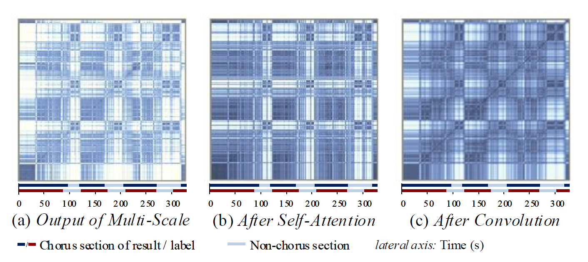
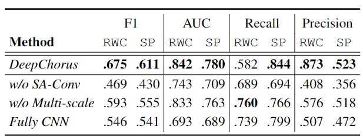
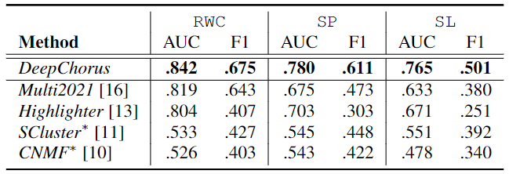

# DeepChorus

**A Hybrid Model of Multi-scale Convolution and Self-attention for Chorus Detection**

[English](./README.md) | [中文](./README_CN.md)

---

## Quick Start

### Environment

```
python==3.6.2
tensorflow==2.1.0
librosa==0.8.1
joblib==1.1.0
madmom==0.16.1  # (required for ICASSP 2021 baseline)
```

### Feature Extraction

Set your audio source path in `preprocess/extract_spectrogram.py`, then run:

```bash
python ./preprocess/extract_spectrogram.py
```

### Testing with Pre-trained Model

Replace `test_feature_files` and `test_annotation_files` in `constant.py` with your extracted feature `.joblib` files and annotation `.joblib` files (format: `dict = {'song_name': [[0, 10], [52, 80], ...], ...}`).

```bash
python ./test.py -n DeepChorus -m Deepchorus_2021
```

This outputs R, P, F and AUC for the test set.

### Training

Replace `train_feature_files` and `train_annotation_files` in `constant.py` similarly, then:

```bash
python ./train.py -n DeepChorus -m Deepchorus_20220304
```

Trained models are saved in `./model/`.

---

## Model Architecture

DeepChorus frames chorus detection as a binary classification problem. The model takes mel-spectrograms as input and outputs a binary vector indicating chorus vs. non-chorus regions. Input songs can be of arbitrary length.

### Multi-Scale Network (HRNet-style)

The core idea is to downsample input features to lower resolutions for extracting global information, then merge back to high resolution. By repeatedly exchanging information across different scales via downsampling/upsampling, the model produces discriminative representations for distinguishing chorus from non-chorus segments.

### Self-Attention Convolution (SA-Conv)

We design an SA-Conv module as the basic building block. Each block contains a self-attention layer followed by convolution layers. Three SA-Conv blocks are stacked to form the main structure. The module processes sequences into probability curves indicating chorus presence.



---

## Overview

Chorus detection aims to identify the chorus sections (the most recurring or "catchiest" parts) from music recordings. DeepChorus is an end-to-end chorus detection model that combines multi-resolution networks with self-attention mechanisms.

Experimental results show that DeepChorus outperforms existing state-of-the-art methods in most cases.

---

## Results

### Ablation Study

Performance with/without HRNet and SA-Conv modules:



### Comparison with Baselines

Comparison with [Pop-Music-Highlighter](https://github.com/remyhuang/pop-music-highlighter), [ICASSP 2021](https://ieeexplore.ieee.org/abstract/document/9413773), [SCluster](https://ieeexplore.ieee.org/abstract/document/6637644), and [CNMF](https://archives.ismir.net/ismir2014/paper/000319.pdf):



---

## Project Structure

```
deepchorus/
├── network/
│   ├── DeepChorus.py      # Model definition
│   └── utils.py           # Utilities (attention, etc.)
├── preprocess/
│   └── extract_spectrogram.py
├── train.py               # Training script
├── test.py                # Testing script
├── generator.py           # Data generator
├── loader.py              # Data loader
├── evaluator.py           # Evaluation metrics
├── constant.py            # Configuration
├── README.md
└── README_CN.md
```

---

## Related Work

- [Pop-Music-Highlighter](https://github.com/remyhuang/pop-music-highlighter)
- [ICASSP 2021 Baseline](https://ieeexplore.ieee.org/abstract/document/9413773)
- [SCluster](https://ieeexplore.ieee.org/abstract/document/6637644)
- [CNMF](https://archives.ismir.net/ismir2014/paper/000319.pdf)

---

## Citation

If you use this code or paper in your research, please cite:

```bibtex
@INPROCEEDINGS{DeepChorus,
  author={He, Qiqi and Sun, Xiaoheng and Zhu, Jun and others},
  title={A Hybrid Model of Multi-scale Convolution and Self-attention for Chorus Detection},
  booktitle={ICASSP 2022 - 2022 IEEE International Conference on Acoustics, Speech and Signal Processing (ICASSP)},
  year={2022},
  pages={4368--4372},
  doi={10.1109/ICASSP43922.2022.9746919}
}
```

Or in arXiv format:

```bibtex
@misc{DeepChorus,
  title={A Hybrid Model of Multi-scale Convolution and Self-attention for Chorus Detection},
  author={Qiqi He and Xiaoheng Sun and Jun Zhu and others},
  year={2022},
  eprint={2202.06338},
  archivePrefix={arXiv},
  primaryClass={eess.AS}
}
```

- **arXiv**: https://arxiv.org/abs/2202.06338
- **IEEE Xplore**: https://doi.org/10.1109/ICASSP43922.2022.9746919
