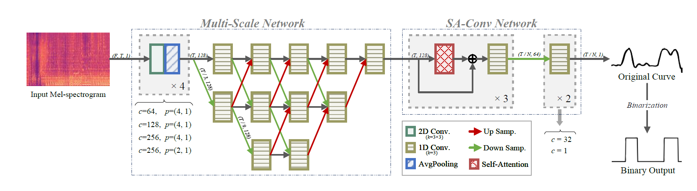
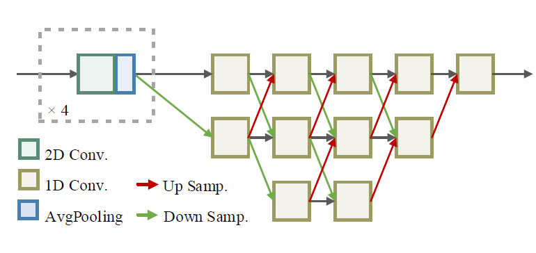
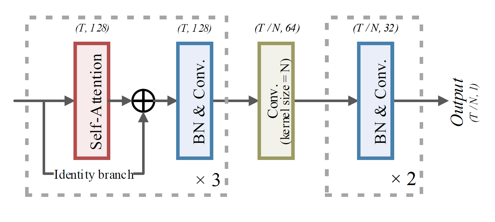
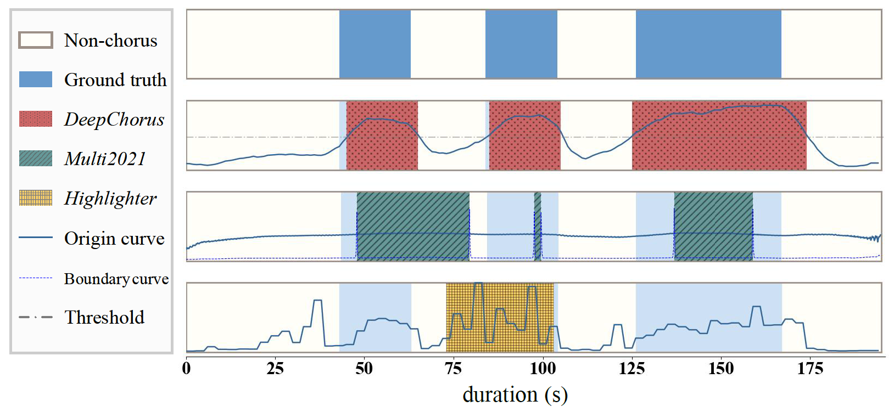

# DeepChorus 版本 1.0

[English](./README.md) | 中文 | [日本語](./README_JP.md)

## 目录

- [任务概览](#任务概览)
- [模型介绍](#模型介绍)
    - [多分辨率网络](#多分辨率网络)
    - [自注意力卷积](#自注意力卷积)
- [实验结果](#实验结果)
    - [消融实验](#消融实验)
    - [对比实验](#对比实验)
- [快速使用](#快速使用)
- [引用](#引用)

## 任务概览

副歌提取（Chorus Detection）旨在提取出一段乐曲中的副歌（乐曲中重复最多或"最抓耳"的部分）段落。本任务开创性地提出了一种结合多分辨率和自注意力机制的端到端副歌检测模型DeepChorus。

本模型的实验结果在大多数情况下都优于现有的最先进的方法。

## 模型介绍



DeepChorus的总体框架如图所示。
我们将合唱检测视为一个分类问题，模型的输出是一个二进制向量，表示副歌或非副歌。模型以mel频谱图作为输入，同时输入歌曲可以是任意长度。

### 多分辨率网络



该模块结构和加入模块前后的效果如上图所示。

该策略的核心思想是：先将输入特征下采样到低分辨率以方便提取全局信息，然后再合并到高分辨率。通过对不同尺度下采样/上采样，并重复交换信息，可以得到能够区分副歌和非副歌的向量，并在几层之后突出区域信息进行进一步处理。

### 自注意力卷积



我们设计了一个SA-Conv（Self-Attention Convolution）模块作为基本模块。在块中，使用了自注意层和卷积层。三个SA-Conv块依次堆叠形成主体结构。本模块采用两个卷积层将序列处理成概率曲线，表示副歌的存在与否。

网络中，自注意力卷积的过程可视化：


## 实验结果

### 消融实验

加入HRNet与否，或加入SA-Conv模块与否的消融实验结果：


### 对比实验

和 [Pop-Music-Highlighter](https://github.com/remyhuang/pop-music-highlighter)、[ICASSP 2021](https://ieeexplore.ieee.org/abstract/document/9413773)、
[SCluster](https://ieeexplore.ieee.org/abstract/document/6637644)、[CNMF](https://archives.ismir.net/ismir2014/paper/000319.pdf) 的对比结果：


和几个baseline对比的可视化：



## 快速使用

### 环境需求

```
python==3.6.2
tensorflow==2.1.0
librosa==0.8.1
joblib==1.1.0
madmom==0.16.1  # (运行ICASSP 2021 baseline时需要)
```

### 提取特征

请先在 `preprocess/extract_spectrogram.py` 中将 `source_path` 更换为音源路径。

执行：

```bash
python ./preprocess/extract_spectrogram.py
```

### 预训练模型测试

请将 `constant.py` 中的 `test_feature_files` 和 `test_annotation_files` 参数分别替换为提取好的特征 `.joblib` 文件和指定标签格式的 `.joblib` 文件，标签格式为：

```python
dict = {'song_name': [[0, 10], [52, 80], ...], ...}
```

执行：

```bash
python ./test.py -n DeepChorus -m Deepchorus_2021
```

该程序返回测试集的 R、P、F 及 AUC 结果。

### 训练

训练需要将 `constant.py` 中的 `train_feature_files` 和 `train_annotation_files` 参数分别替换为提取好的特征 `.joblib` 文件和指定标签格式的 `.joblib` 文件（格式同上）。

执行：

```bash
python ./train.py -n DeepChorus -m Deepchorus_20220304
```

训练后模型将保存在 `./model/` 文件夹中。

## 引用

如果您的研究使用了本代码或论文，请引用：

```bibtex
@INPROCEEDINGS{DeepChorus,
  author={He, Qiqi and Sun, Xiaoheng and Zhu, Jun and others},
  title={A Hybrid Model of Multi-scale Convolution and Self-attention for Chorus Detection},
  booktitle={ICASSP 2022 - 2022 IEEE International Conference on Acoustics, Speech and Signal Processing (ICASSP)},
  year={2022},
  pages={4368--4372},
  doi={10.1109/ICASSP43922.2022.9746919}
}
```

或使用 arXiv 版本：

```bibtex
@misc{DeepChorus,
  title={A Hybrid Model of Multi-scale Convolution and Self-attention for Chorus Detection},
  author={Qiqi He and Xiaoheng Sun and Jun Zhu and others},
  year={2022},
  eprint={2202.06338},
  archivePrefix={arXiv},
  primaryClass={eess.AS}
}
```

- **arXiv**: https://arxiv.org/abs/2202.06338
- **IEEE Xplore**: https://doi.org/10.1109/ICASSP43922.2022.9746919
